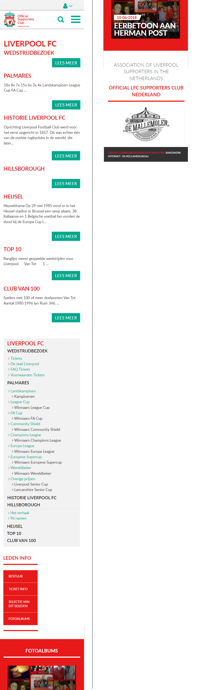

# Procesverslag
Markdown is een simpele manier om HTML te schrijven.  
Markdown cheat cheet: [Hulp bij het schrijven van Markdown](https://github.com/adam-p/markdown-here/wiki/Markdown-Cheatsheet).

 
### Auteur:
Omar Khalifa

#### Je startniveau:
Afgelopen keren heb ik dit vak ook gevolgd, dit ging (suprise, suprise!) niet zo goed. Vandaar: BLAUW

#### Je focus:
Mijn Focus ligt op het moment bij Responsive, als dit beter gaat dan verwacht en ik heb tijd dan ga ik kijken of ik over ga na surface.

## Je website

### Je opdracht:
http://www.liverpoolfc.nl/

#### Screenshot(s) van de eerste pagina (small screen): "Home Liverpool FC": 

#### Screenshot(s) van de tweede pagina (small screen): "Info Liverpool FC":

 

## Breakdownschets (week 1)

uitwerken na afloop 2e werkgroep

### de hele pagina: 

### dynamisch deel (bijv menu): 

### wellicht nog een dynamisch deel (bijv filter): 

## Voortgang 1 (week 2)

### Stand van zaken
Deze week heb ik alleen de html van 1 pagina gemaakt.

### Verslag van meeting
Deze hele week heb ik ziek in bed gelegen waardoor ik niet actief bij de meeting had kunnen zijn.

## Voortgang 2 (week 3)

uitwerken voor 2e voortgang

### Stand van zaken
Gaat redelijk, heb wat moeite met verschillende elementen werkend krijgen.

### Agenda voor meeting
Hoe krijg ik een carrousel werkend?
Hoe krijg ik de ruimte links van de ordered list of unordered list weg?

### Verslag van meeting
Een carrousel kost veel tijd om die goed werkend te maken, ik mag dat ook oplossen met een overflow: scroll;
De ruimte links naast een lijst kan je weghalen door de default padding weg te halen: padding: 0 0 0 0;

## Toegankelijkheidstest (week 4)

uitwerken na test in 8e voortgang

### Bevindingen
Lijst met je bevindingen die in de test naar voren kwamen:

#### Titel eerste bevinding
Hier korte omschrijving (met indien nodig een afbeelding)

Hier een omschrijving van hoe het opgelost kan worden (met indien nodig een afbeelding)

#### Titel tweede bevinding. 
Hier korte omschrijving (met indien nodig een afbeelding)

Hier een omschrijving van hoe het opgelost kan worden (met indien nodig een afbeelding)

#### Titel volgende bevinding. 
Hier korte omschrijving (met indien nodig een afbeelding)

Hier een omschrijving van hoe het opgelost kan worden (met indien nodig een afbeelding)

#### Titel nog een bevinding. 
Hier korte omschrijving (met indien nodig een afbeelding)

Hier een omschrijving van hoe het opgelost kan worden (met indien nodig een afbeelding)

## Voortgang 3 (week 4)

uitwerken voor 3e voortgang

### Stand van zaken
hier dit ging goed & dit was lastig (neem ook screenshots op van delen van je website en code)

### Agenda voor meeting

### Verslag van meeting
Deze week was mijn laptop bij een reparateur omdat deze niet meer aan ging. Hierdoor niet veel aan mijn opdracht kunnen werken.

## Eindgesprek (week 5)

### Stand van zaken
Ik ben verre van klaar. Ik wil dit moment gebruiken om wat vragen te stellen zodat ik mij goed kan voorbereiden op de herkansing.

### Screenshot(s)

hier screenshot(s) van je eindresultaat

## Bronnenlijst

continu bijhouden terwijl je werkt

Nb. Wees specifiek ('css-tricks' als bron is bijv. niet specifiek genoeg).

1. bron 1
2. bron 2
3. ...

